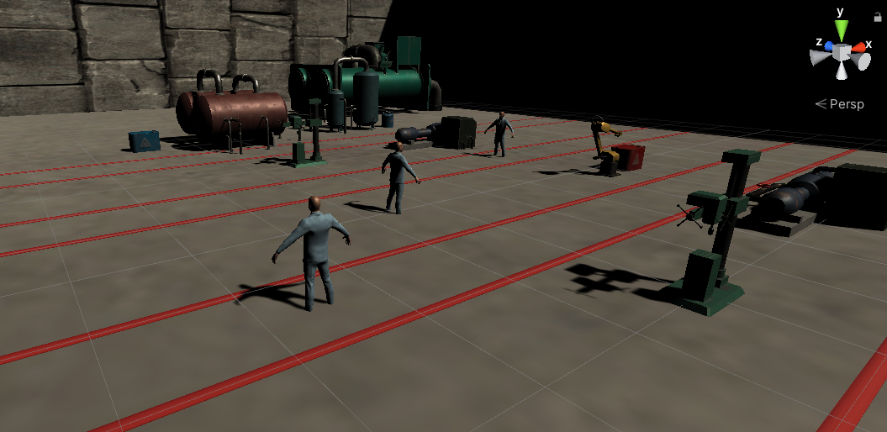

# Factory Environment Modelling

A Unity platform game to demonstrate safe collaboration between factory workers machines and robots to carry out an operatorion on the shop floor. 
This is a factory setup where in manufacturing tasks are scheduled to be carried out by machines, the job of picking and placing of raw materials into shelves is done by robots in collaboration and human operators move around the factory floor to monitor the entire production pipeline. 

**Next steps to establish game platform:** 
1. Adding motion to the operators to move around the factory floor. 
2. Adding ground robots in the unity setup for pick and place task. 
3. Adding drones for factory survellience. 

**Factory floor Environment Learning**
1. Robots learn to maintain distance from operators and machines
2. Robots learn to pick, place and transfer objecs from machine to machine and containers to shelves
3. Operators learn to conduct quality check on certain machines.
4. Adding *collaboration* element among robots while they carry out the operation.
5. Establishing operator-robots interaction in full environment. *Adding enviornment contrainsts for both operators and robots*
6. Adding drones for factory floor survellience
